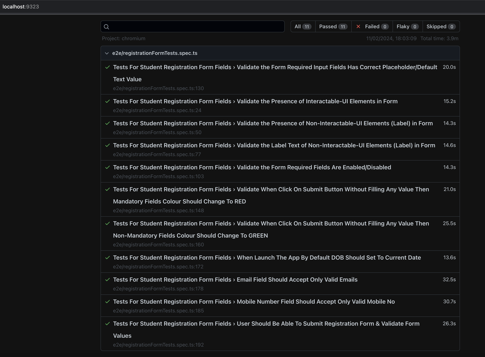

# Demo QA - PlayWright Assignment

To know more detail about assignment please click here [Assignment](https://docs.google.com/document/d/1S_iUGTW5nvb0g-JU7ESxqDDOl2ePZmNTJ4dhRMVeMc8/edit)

### How To Setup Framework ?

#### Pre-Requisites
Install **Node Js v14** Minimum

#### Steps To Setup Framework

* Clone The Repository by running following command `https://github.com/krarpitgupta/groupon-assignment.git`
* Install the npm dependencies using `npm i` or `npm install`
* See the `Running tests` section on how to run the tests

#### Framework Overview

* **data** This folder contains two files named as `testConstants` & `testData` in `json` file format, **testConstants** file contains all the info about static data like form heading and different labels text while **testData** files contains all the test data which is consumed by test for e.g. name, email etc.`testFile.csv` is used to validate upload feature of form

* **locators** The purpose of this folder is to contain all the locators which are required by test scripts in pagewise manner

* **pages** This folder contains two files named as `baseMethods` & `registrationForm`,**baseMethods** contains all the re-usable methods which can be utilised across project while **registrationForm** is an example of page objects model which contain all the methods which are required to perform test specific to Registration Form

* **playwright-report** This folder contains the test report after completion of test execution

* **tests/e2e** This folder contains the test spec files for e.g. `registrationFormTests` which contain all the required test cases

#### Framework Features

* **Page Object Model** Based Framework
* Fully **Data-Driven** Support
* Support **Cross-Browser** for e.g. Chrome, Firefox, Safari
* Support out of the box **Parallel Execution**
* Includes Re-usable **Utility Methods** 
* Easy To Setup/Maintain/Re-use

#### How To Execute Test ?

* Open Terminal and move to root folder of framework for e.g. **groupon-assignment**

* To execute all tests in **Headless** mode in **Chrome Browser** run following command:

`npx playwright test --project=chromium`

* To execute all tests in **Headed (UI)** mode in **Chrome Browser** run following command:

`npx playwright test --headed --project=chromium` 

* To execute all tests in **Headless** mode in **Firefox Browser** run following command:

`npx playwright test --project=firefox`

* To execute all tests in **Headed (UI)** mode in **Firefox Browser** run following command:

`npx playwright test --headed --project=firefox`

* To execute all tests in **Headless** mode in **Safari Browser** run following command:

`npx playwright test --project=webkit`

* To execute all tests in **Headed (UI)** mode in **Safari Browser** run following command:

`npx playwright test --headed --project=webkit`

* To execute all tests in **Headed (UI)** mode in **Parallel** on **Chrome, Firefox, Safari** browser run following command:

`npx playwright test --headed`

* To execute all tests in **Headless** mode in **Parallel** on **Chrome, Firefox, Safari**  browser run following command:

`npx playwright test`

#### How To Generate Report ?

* Once The Test Execution is Completed run following command to generate report:

`npx playwright show-report`

* Test Report Will Be Generated As shown below:

